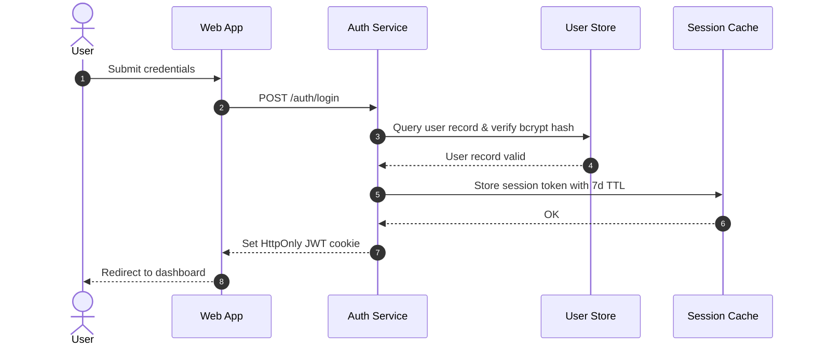

# Authentication & Session Lifecycle

## 1. Credentials Submission
Status: existing
Summary: Client collects user credentials over TLS.

## 2. Token Generation
Status: existing
Summary: Cryptographically signed JWT issued with 7-day expiration.

## 3. Session Cache
Status: new
Summary: Low-latency Redis cluster for active session invalidation on logout.
