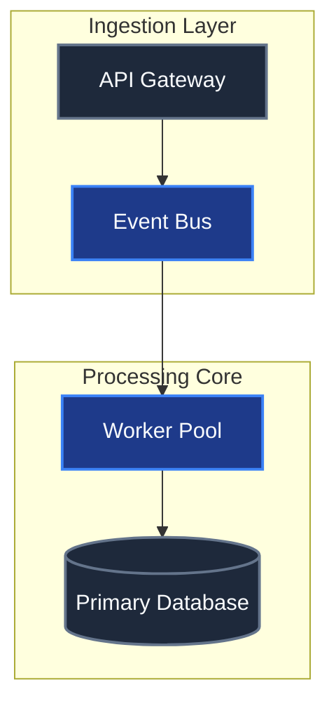

# System Architecture Overview

## 1. API Gateway
Status: existing
Summary: Handles external ingress, authentication, and request routing.

## 2. Event Bus
Status: new
Summary: Decouples intake from processing with persistent buffering.

## 3. Worker Pool
Status: new
Summary: Scalable asynchronous execution workers.

## 4. Primary Database
Status: existing
Summary: Relational database storing core transactional entities.
