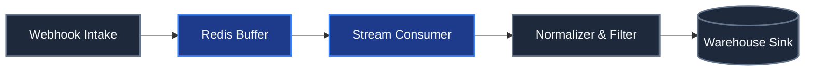

# Ingestion & Pipeline Flow

## 1. Webhook Intake
Status: existing
Summary: High-throughput HTTP receiver for external webhook payloads.
Constraints: Must respond with 202 Accepted within 150ms.

## 2. Redis Buffer
Status: new
Summary: Transient FIFO stream queue preventing pipeline backpressure.
Constraints: Retains messages for at least 24 hours in event of downstream worker downtime.

## 3. Stream Consumer
Status: new
Summary: Auto-scaling consumer group reading stream batches.

## 4. Normalizer & Filter
Status: existing
Summary: Cleanses incoming payload shapes and filters malformed schemas.

## 5. Warehouse Sink
Status: existing
Summary: Analytical storage partitioned by ingestion timestamp.
